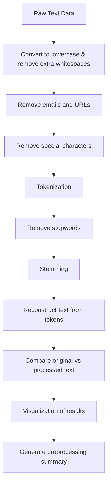

# 📘 Consumer Complaint Text Classification Case Study  

This project focuses on **multi-class text classification** using the **Consumer Complaint Dataset**. The objective was to classify complaints into key financial categories by applying **data preprocessing, feature engineering, sampling strategies, and model benchmarking** across traditional ML, deep learning, and transformer-based approaches.  

---

## 1. Exploratory Data Analysis (EDA) & Feature Engineering  

- The original dataset was **6.5 GB** in size.  
- To reduce complexity, only two columns were retained:  

  - `consumer_complaint_narrative`  
  - `product`  

- After filtering, the dataset size reduced to **3.3 GB**.  
- The `product` column initially contained **21 unique values**.  
- For our use case, only 6 relevant products were selected and mapped to **4 labels**:  

| Product Category | Label |
|------------------|-------|
| Credit reporting, credit repair services, or other personal consumer reports | 0 |
| Credit reporting or other personal consumer reports | 0 |
| Credit reporting | 0 |
| Debt collection | 1 |
| Mortgage | 2 |
| Consumer Loan | 3 |

- After label assignment, the dataset size further reduced to **2.6 GB**.

### Class Distribution Issue  

- Label **3 (Consumer Loan)** was **underrepresented**.  
- To handle imbalance, **Hybrid Sampling** was applied.  
- Final balanced dataset distribution:  

| Label | Count   |
|-------|---------|
| 0     | 300,000 |
| 1     | 300,000 |
| 2     | 300,000 |
| 3     | 300,000 |

---

## 2. Text Preprocessing  

- Cleaning complaint narratives  
- Lowercasing text  
- Removing stopwords, special characters, and numbers  
- Tokenization  
- TF-IDF vectorization (for ML models)  
- Padding & embeddings (for DL models)  

---

## 3. Model Selection & Benchmarking  

To identify the best-performing model, multiple approaches were tested. For faster experimentation, a **sampled dataset of 200,000 rows** was used, with **50,000 per label**.  
Split: **Train: 160,000 | Test: 40,000**  

### ✅ Models Tested  

#### 1) XGBoost  
- **Vectorization:** TF-IDF, vocab size = 5000  
- **Accuracy:** `0.9022`  

**Classification Report:**  

---

#### 2) LightGBM  
- **Vectorization:** TF-IDF, vocab size = 5000  
- **Accuracy:** `0.9383`  

**Classification Report:**  

---

#### 3) CNN  
- **Accuracy:** `0.9232`  

**Classification Report:**  

---

#### 4) LSTM / GRU  
- **Accuracy:** `0.9187`  

**Classification Report:**  

---

#### 5) BiLSTM + Attention  
- **Accuracy:** `0.9215`  

**Classification Report:**  

---

#### 6) Fine-tuned Gemma (with LoRA + 4-bit Quantization)  
- **Status:** Ongoing  

#### 7) Fine-tuned BERT  
- **Status:** Ongoing  

---

## 4. Observations  

- **Traditional ML models (XGBoost, LightGBM)** perform well but rely on TF-IDF, which lacks contextual understanding.  
- **Deep learning models (CNN, LSTM, BiLSTM+Attention)** capture richer patterns but plateau around 92%.  
- **LightGBM achieved the highest accuracy (93.8%) among tested models.**  
- However, **transformer-based models (Gemma, BERT)** are expected to outperform, since they can handle **contextual meaning** in consumer complaints.  

---

## 5. Model Evaluation Summary  

| Model               | Accuracy |
|----------------------|----------|
| XGBoost             | 90.22%   |
| LightGBM            | 93.83%   |
| CNN                 | 92.32%   |
| LSTM / GRU          | 91.87%   |
| BiLSTM + Attention  | 92.15%   |
| Gemma (Fine-tuned)  | Ongoing  |
| BERT (Fine-tuned)   | Ongoing  |

---

## 6. Prediction Workflow  

1. Input: Raw consumer complaint text  
2. Preprocess (clean → tokenize → vectorize/embedding)  
3. Model inference (ML/DL/Transformer)  
4. Output: Predicted label → mapped back to product category  

---

## 7. Conclusion  

- For production deployment, **BERT/Gemma** is recommended due to contextual strength.  
- **LightGBM** provides the best trade-off for speed vs. accuracy on structured features.  
- Hybrid sampling successfully addressed class imbalance.  
- Future work includes **transformer fine-tuning** for improved context-sensitive classification.  

---

## 8. Advancements

- Fine Tune Tiny Recursive Model of Samsung after testing it
